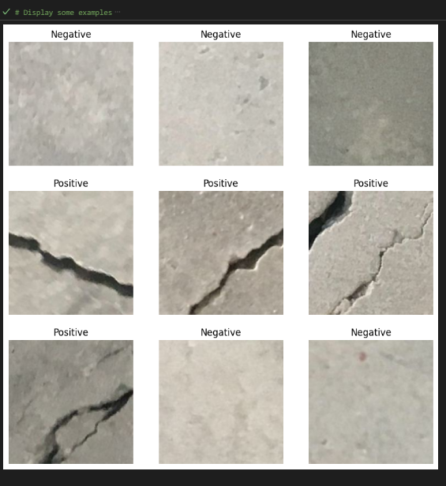
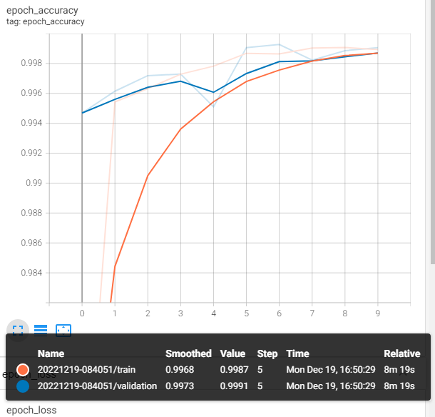
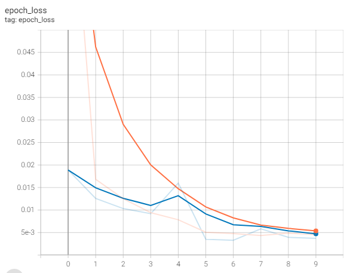

# Image Classification of Concrete with Cracks or without Cracks by using TensorFlow

## Summary

Common concrete cracks can occur for a variety of reasons and come in many different forms. The causes could be as a result of poor design, which can result in structural cracks. Additionally, settlement cracks can appear when a portion of concrete dips or when the earth beneath the slab isn't compacted properly. Other than that, there are concrete cracks namely hairline cracks which usually develop in concrete foundation as the concrete cures while shrinkage cracks occur while the concrete is curing.

If cracks are not detected in time, they could jeopardise a building's stability and safety. Therefore, by creating this model, it could facilitate the easy identification of cracked objects and aid to save thousands of lives.

1. Data Preparation

  <ol>- Upload the dataset using operating system (os) to fetch the contents in the current directory.</ol>
  <ol>- Load the data as tensorflow dataset by using special method. Split the dataset into train dataset and validation dataset.</ol>
  <ol>- Extract the class names as a list.</ol>
  <ol>- Display some examples to see if the dataset has been uploaded successfully.</ol>
  

  
<ol>The figure above shows the random images in the dataset and it's label.</ol>

  <ol>-Then, convert the dataset into prefetch dataset.</ol>
  

2. Model Development

   <ol>- In this part, I create a model augmentation. I could rotate the image in many form. So it can increase the diversity of the training set by applying random (but realistic) transformations.</ol>
  <ol>-Then, I applied the data augmentation into one image to see the result.</ol>
  
  <ol>- To proceed on doing transfer learning, I create the layer for data normalization by using <strong>tf.keras.applications.mobilenet_v2.preprocess_input.</strong></ol>
  <ol>- Then, I start the transfer learning by instantiate the pretrained model.</ol>
  <ol>- I set the pretrained model as non-trainable to avoid destroying any of the information they contain during future training rounds.</ol>
  <ol>- Create the new classifier by using <strong>layers.GlobalAveragePooling2D()</strong>.</ol>
  <ol>- The <strong>Dense layer</strong> is being used to create an output layer.</ol>
  <ol>- Link the layers together.</ol>
  <ol>- Initiate the full model pipeline and compile the model.</ol>
<ol>- Evaluate the model before combine with testing data. The accuracy we got is 50%.</ol>
<ol>- The accuracy can be improved by applying tensorboard call back and early stopping.</ol>
<ol>- The accuracy was around 99%.</ol>
<ol>- Then, I proceed to include testing data.</ol>
<ol>- I applied transfer learning and use for loop to freeze some layers.</ol>
<ol>The epoch was set to follow up the previous model training.</ol>
<ol>- Then, I compiled the model and did the model training.</ol>

3. Model Deployment

<ol>- The accuracy we got is 100%. The image below shows my classification report.</ol>
 

 
 

 
<ol> This is the accuracy graph. As we can see in the graph, the model is good fit. It is because I used transfer learning during model development. Transfer learning models achieve optimal performance faster than the traditional ML models. It is because the models that leverage knowledge (features, weights, etc.) from previously trained models already understand the features.</ol>

  
 

 
## Acknowledgement
Special thanks to ([https://data.mendeley.com/datasets/5y9wdsg2zt/2](https://data.mendeley.com/datasets/5y9wdsg2zt/2)) :smile:
